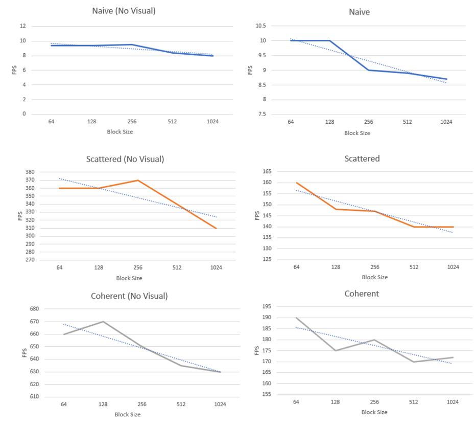

Project 1 Flocking
====================

**University of Pennsylvania, CIS 565: GPU Programming and Architecture Project 1 - Flocking**

Hannah Bollar: [LinkedIn](https://www.linkedin.com/in/hannah-bollar/), [Website](http://hannahbollar.com/)

Tested on: Windows 10 Pro, i7-6700HQ @ 2.60GHz 15.9GB, GTX 980M (Personal), CUDA 8.0, Visual Studio 2015.
____________________________________________________________________________________

# Boids

## Artificial Life
This is an artificial life program akin to [Conway's Game of Life](http://www.biota.org/book/chbi/chbi4.htm). For these programs, the user defines an initial state, and every following state organically develops through a set of predefined rules of the program. Instead of pixel changes like in Conway's Game of Life, this boid implementation developed by Craig Reynolds in 1986 is meant to define boid movements and in doing so simulate the flocking movement and orientation of birds in flight. 

Example visuals of coherent grid, the most efficient implementation.

| 10,000 Boids | 50,000 Boids |
| ------------- | ----------- |
|   |  |

## Rules
Since the execution is defined based on the initial state, the current implementation has a scattered initial distribution of the boid positions (each boid is a particle in the visual). There is also a positional wrapping, so that as the boids continue moving throughout the grid, they are maintained in the same cube of space, making the simulation more interesting.

In regards to the actual rules defined for the simulation - we have the following three ideas:
* `adhesion` - a force aiming to push every boid to the center of mass of all boids near it
* `avoidance/dodging` - a force aiming to push every boid away from every other boid near it
* `cohesion` - a force aiming to make each boid have a similar velocity to those near it

The psuedocode is as follows:
```
rule1_adhesion(Boid boid)
    vector perceived_center = 0
    float neighbor_count = 0

    foreach Boid b:
        if b != boid and distance(b, boid) < rule1Distance then
            perceived_center += b.position
            ++neighbor_count
        endif
    end
    perceived_center /= neighbor_count

    return (perceived_center - boid.position) * rule1Scale
```
```
rule2_avoidance_dodging(Boid boid)
    vector avoidance_velocity = 0

    foreach Boid b
        if b != boid and distance(b, boid) < rule2Distance then
            avoidance_velocity += (boid.position - b.position)
        endif
    end

    return avoidance_velocity * rule2Scale
```
```
rule3_cohesion(Boid boid)
    vector cohesive_velocity = 0
    float neighbor_count = 0

    foreach Boid b
        if b != boid and distance(b, boid) < rule3Distance then
            cohesive_velocity += b.velocity
            ++neighbor_count
        endif
    end
    cohesive_velocity /= neighbor_count

    return cohesive_velocity * rule3Scale
```

Since these only affect the delta by which a current velocity should be updated, the updated velocity for a current value is as follows: `updated_vel = current_vel + rule1_adhesion + rule2_avoidance_dodging + rule3_cohesion`

For more reference regarding the pseudocode see [this](http://www.vergenet.net/%7Econrad/boids/pseudocode.html) derivation.

## Grid System
For each boid, each rule is enacted on the boid itself and those within a specific distance near the boid to create the grouping effect we see in the final output. The way we actually find which boids are within those distances depends on how we're searching through our grid system.

### Naive

For the first implementation, we iterate over every grid cell checking if any boid inside of the grid cell is within any of the specified distances for each of the three defined rules. This is costly for runtime as we're iterating over the entire grid width in all three dimensions.

### Scattered

For the second implementation, we optimize our search based on a max distance instead of iterating over every grid cell possible. We set this distance as the max value of all three of the rule's comparison distances: `max_distance = max(rule1_distance, max(rule2_distance, rule3_distance))`.


Then for each boid, we limit our search area based on the grid cells that have any aspect of them within the `max_distance`. This allows us to avoid having to do a positional comparison with the corner points of each grid cell, while at the same time also allowing a more flexible approach since we're just defining a min cell index and max cell index in all three cardinal directions. That is, we dont have to manually check a hard-coded specific number of surrounding cells depending on the implementation (such as the 8 surrounding cells, 27 surrounding cells, etc).


Also because we want to allow this grid to be placed anywhere in space, for other implementation purposes and project extensions, every time we do a position comparison to find a grid index, we must make sure the grid is zeroed. That is, we must make sure that the origin of our grid, which is not guaranteed to be `(0, 0, 0)`, is actually `(0, 0, 0)` for our calculations. Thus, when doing update calculations, we must offset each position value by the grid origin's location: `position_for_calculation = (position - gridOrigin)`.


### Coherent

For the third implementation, we used the same algorithmic idea as in the scattered implementation; however, we speed up the runtime by changing one function call. In doing so, it removes an exaggerated runtime cost by taking away an additional call in the `for loop` inside the triple `for loop` of our velocity update and adding a one time call to the timestep update.

For the following example grid, each implementation has slightly different buffers.


The switch in what buffers are used means that as we are iterating over the boids inside a cell index, this
```
int on_boid = particleArrayIndices[given_index];
if (on_boid == particle_index) { continue; }
glm::vec3 boid_position = pos[on_boid];
```
can be shortened just to this
```
if (given_index == particle_index) { continue; }
glm::vec3 boid_position = pos[given_index];
```
This change is because for the simple grid implementation, the given index of a boid in the cell does not match the same index in its position and velocity buffers since the cell's one is out of order. In the simple implementation, we use a buffer that maps this `given_index` to the appropriate index in the `positions` and `velocity` buffers. To fix this, in the `simulationStep` we actually shuffle the elements in our `position` and `velocity` buffers to match the same ordering as that of the grid cell index buffer. That way, the cell index that we're iterating over is the same index that corresponds to the position and velocity values in those buffers as well.

# Runtime Analysis

The generic boid simulation comparing each implementation's runtime with an increasing number of boids in the simulations.


Instead of comparing based on the number of boids in the simulation, below is a comparison of what happens when the block size starts increasing. It has a boid count of `50K`.


But what's a boid simulation without a visual? Below is a runtime comparison of how much the realtime visual output actually affects the simulation speed. The red line is to reflect the large difference in runtime speed.


Below is the same comparison except again we're changing the block size instead of the boid count. It has a boid count of `50K`.


Here's a blown up version of that graph's results for each implementation with a blue line to show an overall *marginally* downward trend.



# Questions

### In Progress.

<b>For each implementation, how does changing the number of boids affect performance? Why do you think this is?</b>

In general, the more items that need to be checked, the slower the simulations will run.

<b>For each implementation, how does changing the block count and block size affect performance? Why do you think this is?</b>

It slows down the performance. Block size is threads per block on the gpu. The larger the block size, the fewer number of blocks are being put through the gpu. Whereas the smaller the block size, the larger the number of blocks being put through the gpu.

<b>For the coherent uniform grid: did you experience any performance improvements with the more coherent uniform grid? Was this the outcome you expected? Why or why not?</b>

Definitely yes. As explained in the coherent grid section above the change implemented for the coherent grid from the scattered grid implementation removes an exaggerated runtime cost by taking away an additional call in the `for loop` inside the triple `for loop` of our velocity update and adding a one time shuffling call to the timestep update.

<b>Did changing cell width and checking 27 vs 8 neighboring cells affect performance? Why or why not? Be careful: it is insufficient (and possibly incorrect) to say that 27-cell is slower simply because there are more cells to check!</b>

Partially. The larger cell width slows down performance. For the more streamlined simulations, my implementation searches from a `min grid bound` to a `max grid bound` based on the `max distance` from the boid in question. The smaller the grid size, the more refined the bounds become and the less chance there is for more particles *not* within the `max distance` to be unnecessarily checked. This also because the number of cells is much less than the number of boids, so the influence of more extraneous boids being checked in the larger cell check case is more substantial than the contrary increase in the number of blocks being checked in the smaller block case.
